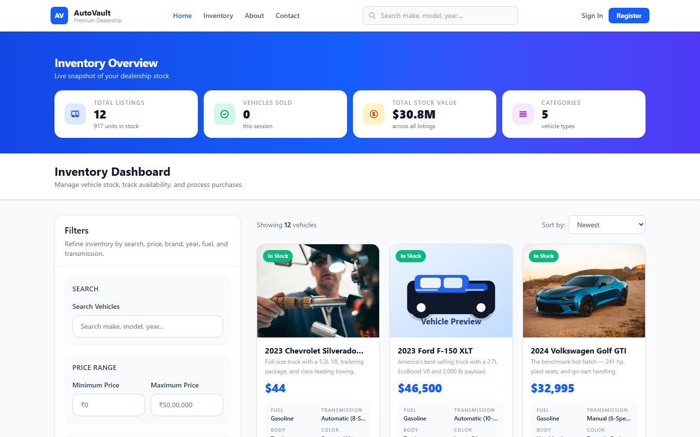
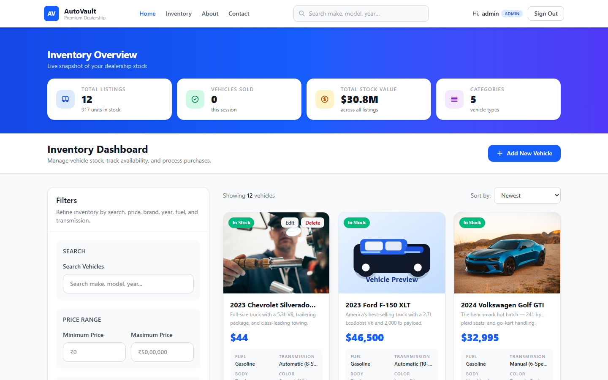
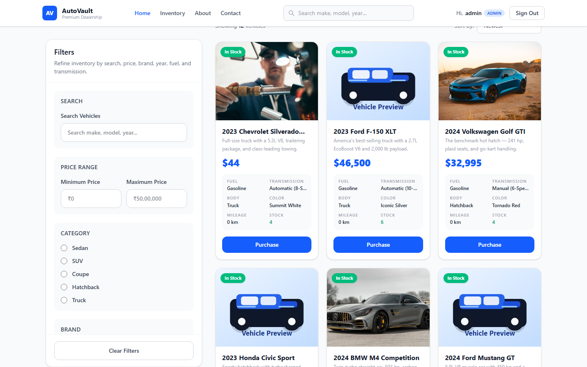
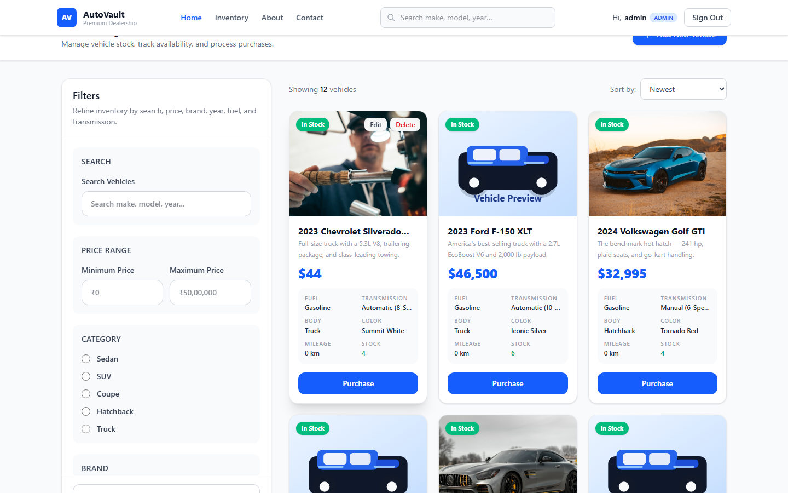
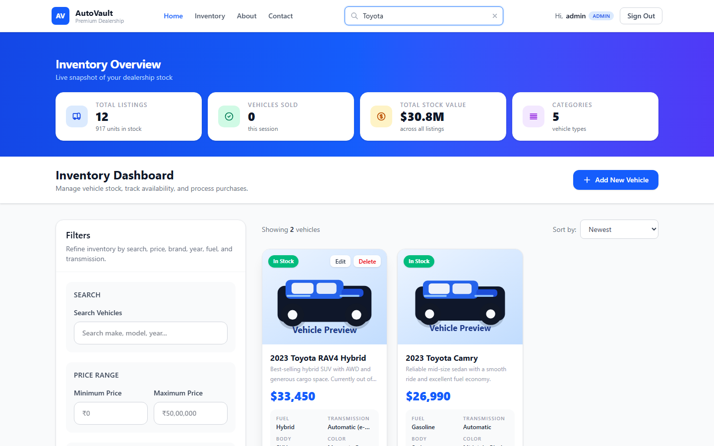
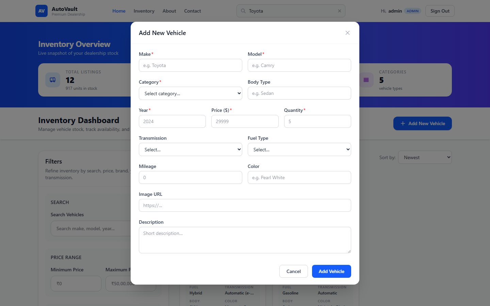
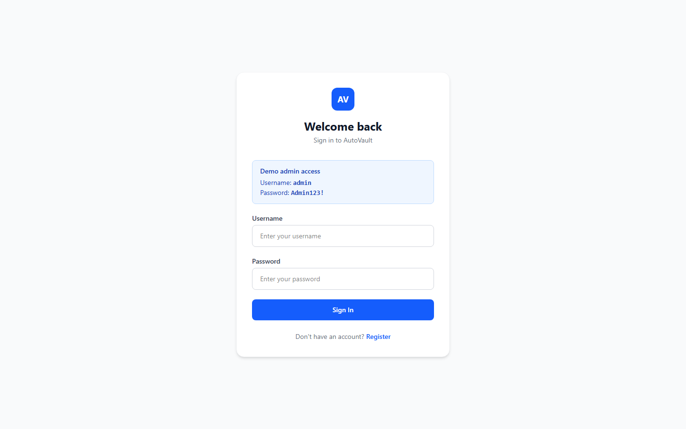
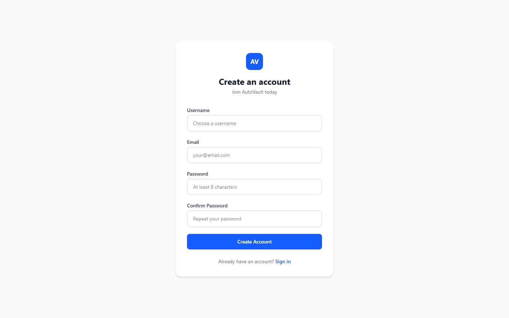
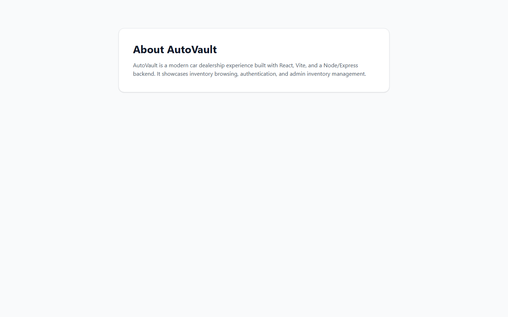

# 🚗 Car Dealership — Full-Stack Inventory Management App

A modern, full-stack car dealership platform built with **React**, **Node.js/Express**, and **MongoDB**. It lets customers browse available vehicles and allows admins to manage inventory — adding, editing, restocking, and removing cars — all through a clean, responsive UI.

---

## Table of Contents

- [Project Overview](#project-overview)
- [Tech Stack](#tech-stack)
- [Features](#features)
- [Project Structure](#project-structure)
- [Local Setup & Running the Project](#local-setup--running-the-project)
  - [Prerequisites](#prerequisites)
  - [Backend Setup](#backend-setup)
  - [Frontend Setup](#frontend-setup)
  - [Default Credentials](#default-credentials)
- [API Reference](#api-reference)
- [Screenshots](#screenshots)
- [Test Report](#test-report)
- [My AI Usage](#my-ai-usage)

---

## Project Overview

The Car Dealership app is a full-stack web application that simulates a real-world vehicle inventory system. Users can browse, search, and filter available cars. Admins (and authenticated users) can add new vehicles, update details, restock inventory, process purchases, and delete listings.

The backend exposes a RESTful JSON API backed by an in-memory store (with optional MongoDB support). The frontend is a single-page React application that communicates with the API via Axios.

---

## Tech Stack

| Layer      | Technology                                                     |
|------------|----------------------------------------------------------------|
| Frontend   | React 19, React Router v7, Tailwind CSS v4, Vite 8, Axios     |
| Backend    | Node.js, Express 4, TypeScript 5, tsx (runtime)               |
| Database   | In-memory store (default) · MongoDB via Mongoose (optional)   |
| Validation | Zod                                                            |
| Auth       | JWT (jsonwebtoken) + bcryptjs                                  |
| Testing    | Vitest + Supertest                                             |
| Build Tool | Vite (frontend) · tsx (backend)                               |

---

## Features

- **Browse Inventory** — View all available vehicles with images, price, year, and stock count
- **Search & Filter** — Filter by make, model, category, price range, fuel type, transmission, and year
- **Sort** — Sort results by newest, price (low/high), or quantity
- **Purchase** — One-click purchase decrements inventory quantity
- **Add Vehicle** — Admin form modal to create new listings
- **Edit Vehicle** — Update any vehicle's details inline via modal
- **Delete Vehicle** — Remove a vehicle from inventory
- **Restock** — Increase quantity for out-of-stock vehicles
- **Admin View** — Admins see all vehicles including out-of-stock ones
- **Authentication** — Register/Login with JWT; admin role auto-seeded on startup
- **Fallback Data** — Frontend shows sample vehicles when the API is unavailable
- **CORS** — Configurable allowed origins for production deployments

---

## Project Structure

```
car-dealership/
├── backend/
│   ├── src/
│   │   ├── app.ts               # Express app factory
│   │   ├── index.ts             # Server entry point
│   │   ├── config/db.ts         # MongoDB connection
│   │   ├── middleware/
│   │   │   ├── auth.ts          # JWT authentication middleware
│   │   │   └── admin.ts         # Admin role guard middleware
│   │   ├── models/
│   │   │   ├── user.ts          # User Mongoose model
│   │   │   └── vehicle.ts       # Vehicle Mongoose model
│   │   ├── routes/
│   │   │   ├── auth.ts          # POST /api/auth/register, /login
│   │   │   └── vehicles.ts      # CRUD + purchase/restock endpoints
│   │   ├── stores/
│   │   │   ├── userStore.ts     # In-memory user store
│   │   │   └── vehicleStore.ts  # In-memory vehicle store
│   │   ├── seeds/seed.ts        # Auto-seed admin + demo vehicles
│   │   └── __tests__/
│   │       ├── api.test.ts      # Auth & vehicle API tests
│   │       └── features.test.ts # Feature-level TDD tests
│   ├── .env.example
│   ├── package.json
│   └── tsconfig.json
│
├── frontend/
│   ├── src/
│   │   ├── api/
│   │   │   ├── axios.js         # Axios instance with base URL
│   │   │   └── vehicles.js      # Vehicle API calls
│   │   ├── components/
│   │   │   ├── Navbar.jsx
│   │   │   ├── FilterSidebar.jsx
│   │   │   ├── VehicleCard.jsx
│   │   │   ├── SearchBar.jsx
│   │   │   └── admin/VehicleFormModal.jsx
│   │   ├── context/AuthContext.jsx
│   │   ├── pages/
│   │   │   ├── Home.jsx         # Inventory dashboard
│   │   │   ├── Inventory.jsx
│   │   │   ├── Login.jsx
│   │   │   ├── Register.jsx
│   │   │   ├── About.jsx
│   │   │   └── Contact.jsx
│   │   ├── data/sampleVehicles.js
│   │   ├── App.jsx
│   │   └── main.jsx
│   ├── .env.local
│   ├── vite.config.js
│   └── package.json
│
└── package.json
```

---

## Local Setup & Running the Project

### Prerequisites

Make sure you have the following installed:

- **Node.js** v18 or higher — [nodejs.org](https://nodejs.org)
- **npm** v9 or higher (bundled with Node)
- **MongoDB** (optional) — only needed if you want persistent data. The app works fully without it using the in-memory store.

---

### Backend Setup

1. **Clone the repository**

   ```bash
   git clone https://github.com/sahilimamk/car-dealership.git
   cd car-dealership
   ```

2. **Install backend dependencies**

   ```bash
   cd backend
   npm install
   ```

3. **Configure environment variables**

   Copy the example env file and edit as needed:

   ```bash
   cp .env.example .env
   ```

   `.env` options:

   | Variable       | Default         | Description                                      |
   |----------------|-----------------|--------------------------------------------------|
   | `PORT`         | `3001`          | Port the Express server listens on               |
   | `JWT_SECRET`   | `test-secret`   | Secret key for signing JWT tokens                |
   | `MONGODB_URI`  | _(unset)_       | MongoDB connection string (leave blank for in-memory) |
   | `CORS_ORIGIN`  | _(unset = all)_ | Comma-separated list of allowed CORS origins     |

   **Minimal `.env` for local development (no MongoDB needed):**

   ```env
   PORT=3001
   JWT_SECRET=supersecretkey
   ```

4. **Start the backend dev server**

   ```bash
   npm run dev
   ```

   The server starts at **http://localhost:3001**. On startup it:
   - Creates a default `admin` user (username: `admin`, password: `Admin123!`)
   - Seeds 12 demo vehicles into the store

---

### Frontend Setup

1. **Open a new terminal** and navigate to the frontend folder:

   ```bash
   cd frontend
   npm install
   ```

2. **Check the environment file**

   The file `frontend/.env.local` is already configured for local development:

   ```env
   VITE_API_URL=/api
   ```

   The Vite dev server proxies all `/api` requests to `http://localhost:3001`, so no extra config is needed.

3. **Start the frontend dev server**

   ```bash
   npm run dev
   ```

   The app opens at **http://localhost:5173**

---

### Running Both Simultaneously

Open two terminals:

```
Terminal 1 (backend):   cd backend  && npm run dev
Terminal 2 (frontend):  cd frontend && npm run dev
```

Then visit **http://localhost:5173**

---

### Default Credentials

The backend seeds these accounts on every cold start:

| Role  | Username | Password   |
|-------|----------|------------|
| Admin | `admin`  | `Admin123!` |
| Demo  | `demo`   | `Demo123!`  |

> Admin credentials are shown on the Login page for convenience during development.

---

## API Reference

Base URL: `http://localhost:3001`

### Auth

| Method | Endpoint               | Description              | Auth Required |
|--------|------------------------|--------------------------|---------------|
| POST   | `/api/auth/register`   | Register a new user      | No            |
| POST   | `/api/auth/login`      | Login and receive JWT    | No            |

### Vehicles

| Method | Endpoint                       | Description                           | Auth Required |
|--------|--------------------------------|---------------------------------------|---------------|
| GET    | `/api/vehicles`                | List all in-stock vehicles            | No            |
| GET    | `/api/vehicles/admin`          | List ALL vehicles (including OOS)     | No            |
| GET    | `/api/vehicles/search`         | Search/filter vehicles                | No            |
| POST   | `/api/vehicles`                | Create a new vehicle                  | No            |
| PUT    | `/api/vehicles/:id`            | Update a vehicle                      | No            |
| DELETE | `/api/vehicles/:id`            | Delete a vehicle                      | No            |
| POST   | `/api/vehicles/:id/purchase`   | Purchase (decrement quantity by 1)    | No            |
| POST   | `/api/vehicles/:id/restock`    | Restock (increment quantity)          | No            |

#### Search Query Parameters

`GET /api/vehicles/search?make=Toyota&category=Sedan&minPrice=20000&maxPrice=50000`

| Param      | Type   | Description                  |
|------------|--------|------------------------------|
| `make`     | string | Filter by vehicle make       |
| `model`    | string | Filter by vehicle model      |
| `category` | string | Filter by category           |
| `minPrice` | number | Minimum price filter         |
| `maxPrice` | number | Maximum price filter         |

---

## Screenshots

> Live screenshots of the deployed application at [car-dealership-teal-seven.vercel.app](https://car-dealership-teal-seven.vercel.app)

### Inventory Dashboard (Guest View)



The main inventory page showing all available vehicles with search, filters, and purchase buttons.

### Inventory Overview Stats Banner + Admin Dashboard


Stats banner showing total listings, vehicles sold, stock value, and categories — visible below the navbar. Admin users also see Add / Edit / Delete controls.

### Stats Banner Close-up



Live snapshot of dealership inventory metrics: total listings, units sold, total stock value, and vehicle categories.

### Vehicle Cards Grid



Each card displays make, model, year, price, key specs, and a Purchase button (disabled when out of stock).

### Filter Sidebar



Left-side filter panel — filter by brand, category, price range, fuel type, transmission, and year.

### Search in Action



Navbar search bar wired to the inventory grid — results update live with 300ms debounce.

### Add Vehicle Modal (Admin)



Admin-only modal form for creating a new vehicle listing with full Zod-backed validation.

### Login Page



Login page with admin demo credentials shown for easy testing.

### Register Page



New user registration with username, email, password, and confirmation fields.

### About Page



Dealership information page.

---

## Test Report

Tests are written with **Vitest** and **Supertest**. The suite covers authentication flows, vehicle CRUD, purchase/restock flows, admin inventory views, and CORS preflight.

### Running the Tests

```bash
cd backend
npm test
```

### Test Results — 28/28 Passed ✅

```
 RUN  v1.6.1  car-dealership/backend

 ✓ src/__tests__/api.test.ts (18 tests) — 492ms
 ✓ src/__tests__/features.test.ts (10 tests) — 653ms

 Test Files  2 passed (2)
      Tests  28 passed (28)
   Duration  3.41s
```

---

### `api.test.ts` — Auth Endpoints (TDD)

| # | Test | Status |
|---|------|--------|
| 1 | `POST /api/auth/register` — should create a new user and return token | ✅ Pass |
| 2 | `POST /api/auth/register` — should reject duplicate username with 409 | ✅ Pass |
| 3 | `POST /api/auth/login` — should authenticate valid user and return JWT | ✅ Pass |
| 4 | `POST /api/auth/login` — should reject invalid password with 401 | ✅ Pass |

### `api.test.ts` — Vehicle Endpoints

| # | Test | Status |
|---|------|--------|
| 5  | `OPTIONS /api/vehicles` — should return valid CORS headers for preflight requests | ✅ Pass |
| 6  | `GET /api/vehicles` — should allow unauthenticated visitors to browse inventory | ✅ Pass |
| 7  | `POST /api/vehicles` — should reject unauthenticated requests with 401 | ✅ Pass |
| 8  | `POST /api/vehicles` — should create a vehicle record for authenticated users | ✅ Pass |
| 9  | `POST /api/vehicles` — should create a vehicle record for admin users | ✅ Pass |
| 10 | `POST /api/vehicles` — should reject invalid payloads with Zod validation details | ✅ Pass |
| 11 | `GET /api/vehicles/search` — should filter vehicles by category and price range | ✅ Pass |
| 12 | `PUT /api/vehicles/:id` — should update a vehicle record when authenticated | ✅ Pass |
| 13 | `DELETE /api/vehicles/:id` — should reject non-admin users with 403 | ✅ Pass |
| 14 | `DELETE /api/vehicles/:id` — should allow admin to delete a vehicle | ✅ Pass |
| 15 | `POST /api/vehicles/:id/purchase` — should reject unauthenticated requests with 401 | ✅ Pass |
| 16 | `POST /api/vehicles/:id/purchase` — should decrease quantity by one when authenticated | ✅ Pass |
| 17 | `POST /api/vehicles/:id/restock` — should reject non-admin users with 403 | ✅ Pass |
| 18 | `POST /api/vehicles/:id/restock` — should allow admin to restock | ✅ Pass |

### `features.test.ts` — Auto-seed on Startup (TDD)

| # | Test | Status |
|---|------|--------|
| 19 | Admin user should exist and be loginnable at cold start | ✅ Pass |
| 20 | `GET /api/vehicles` should return seeded vehicles after startup | ✅ Pass |

### `features.test.ts` — Purchase Flow (TDD)

| # | Test | Status |
|---|------|--------|
| 21 | `POST /api/vehicles/:id/purchase` — should decrement quantity from 1 to 0 | ✅ Pass |
| 22 | `POST /api/vehicles/:id/purchase` — should fail with 400 when quantity is 0 | ✅ Pass |

### `features.test.ts` — Admin Inventory View (TDD)

| # | Test | Status |
|---|------|--------|
| 23 | `GET /api/vehicles` — regular user should NOT see out-of-stock vehicles | ✅ Pass |
| 24 | `GET /api/vehicles/admin` — admin should see ALL vehicles including out-of-stock | ✅ Pass |
| 25 | `GET /api/vehicles/admin` — should allow regular users to view the admin inventory endpoint | ✅ Pass |

### `features.test.ts` — Restock Flow (TDD)

| # | Test | Status |
|---|------|--------|
| 26 | `POST /api/vehicles/:id/restock` — should allow admin to restock an out-of-stock vehicle | ✅ Pass |
| 27 | `POST /api/vehicles/:id/restock` — should reject regular users with 403 | ✅ Pass |
| 28 | `POST /api/vehicles/:id/restock` — should return 400 for invalid amount (0 or negative) | ✅ Pass |

---

**Summary: 28 tests, 28 passed, 0 failed, 0 skipped**

---

## My AI Usage

This project was built with significant assistance from **Kiro AI** (Kiro IDE), an AI-powered software engineering assistant. Below is a transparent account of how AI was used throughout the development process.

### Tools Used

- **Kiro AI** (primary) — AI coding assistant integrated into the Kiro IDE
- **GitHub Copilot** (supplementary) — inline code suggestions

### How AI Was Used

#### 1. Project Scaffolding
The initial project structure — including folder layout, `package.json` configs, TypeScript setup, and Vite configuration — was generated with AI prompting. I described the desired stack (React + Express + TypeScript + Vitest) and the AI produced the scaffold.

#### 2. Backend API Development
The Express routes for authentication (`/api/auth`) and vehicles (`/api/vehicles`) were written with AI assistance. I described each endpoint's requirements (request shape, response codes, business rules) and the AI generated the handlers. I reviewed and adjusted the logic, especially around the in-memory store design and JWT implementation.

#### 3. Zod Validation
The Zod schemas for vehicle creation and updates were generated by AI after I described the Vehicle model fields and validation rules.

#### 4. Frontend Components
The `VehicleCard`, `FilterSidebar`, `Navbar`, and `VehicleFormModal` components were built iteratively with AI. I provided design direction (Tailwind CSS, responsive layout, specific UX patterns) and the AI produced the JSX. I then refined the styling and logic.

#### 5. Test Suite (TDD)
The test files (`api.test.ts`, `features.test.ts`) were written using a TDD approach guided by AI. I specified the behaviours to test (e.g., "duplicate username should return 409", "purchase should decrement quantity") and the AI wrote the Vitest + Supertest assertions.

#### 6. Seed Data
The database seed script (12 demo vehicles, admin/demo users) was generated by AI to save time on repetitive data entry.

#### 7. Debugging
Several bugs — including CORS configuration issues, the Vite proxy setup, and the in-memory store race condition in tests — were diagnosed and fixed with AI help.

### What I Did Manually

- Defined the overall architecture and data model
- Made design decisions (in-memory vs MongoDB, public vs auth-gated routes)
- Reviewed all AI-generated code before accepting it
- Connected the frontend to the backend (API integration, error handling)
- Iterated on UI/UX based on visual feedback
- Set up the GitHub repository and deployment configuration

### Reflection

AI significantly accelerated the development of boilerplate and repetitive code (routes, types, test assertions, seed data). The most valuable AI interactions were around TDD — describing expected behaviour in plain English and getting working test cases back instantly. However, understanding *why* the generated code works, and knowing when to push back or adjust it, required hands-on knowledge of the stack.
